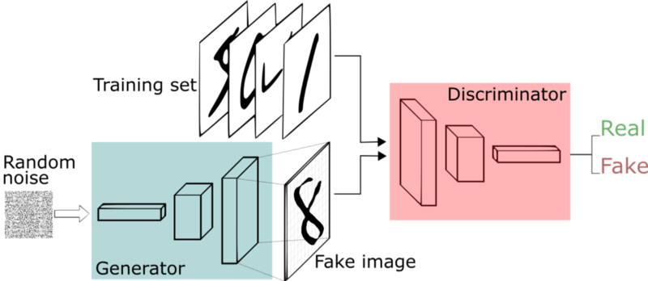

# Generative Adversarial Networks

**Generative Adversarial Networks**, or **GANs** for short, are an approach to generative modeling using deep learning methods, devised by [Goodfellow et al](https://arxiv.org/abs/1406.2661). in 2014. 

Generative modeling is an unsupervised learning task in machine learning that involves automatically discovering and learning the regularities or patterns in input data in such a way that the model can be used to generate or output new examples that plausibly could have been drawn from the original dataset.

GANs are a clever way of training a generative model by framing the problem as a supervised learning problem with two sub-models. In a `GAN` setup, two differentiable functions, represented by neural networks, are locked in a game.The two players (the generator and the discriminator) have different roles in this framework.

The `generator` tries to produce data that come from some probability distribution. 

The `discriminator` acts like a judge. It gets to decide if the input comes from the generator or from the true training set.

## DCGAN

## Table of Contents
- [DCGAN Notebook](notebook/dcgan_mnist.ipynb)

